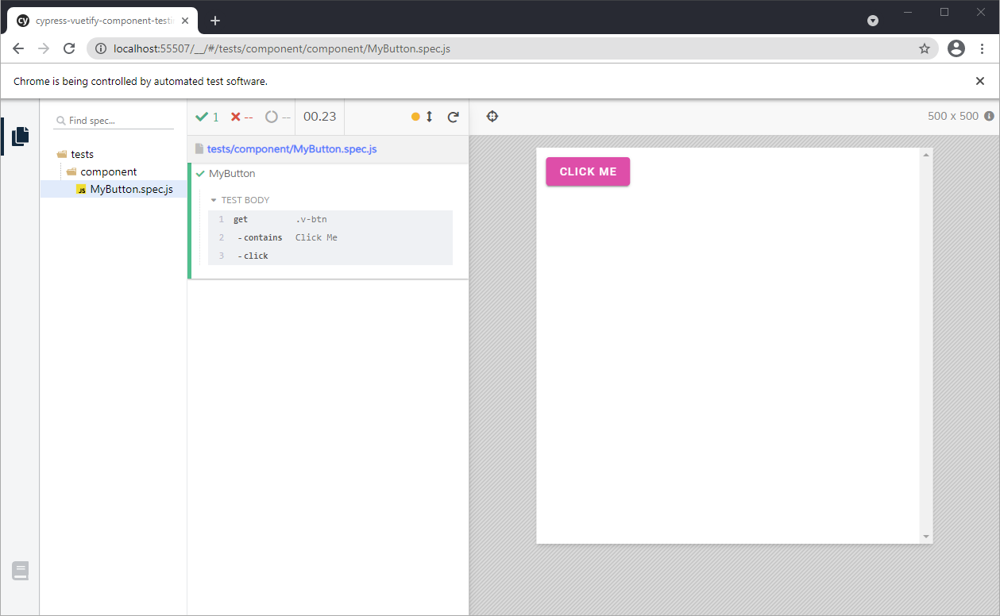

# Cypress Component Testing with Vue and Vuetify

Cypress is currently (2021-04-22) developing [a component testing library](https://docs.cypress.io/guides/component-testing/introduction). This is a sample project that shows how to configure Cypress component testing to work with Vue (v2.x) and Vuetify (v2.x).

## To Install This App Locally and Run Cypress

```sh
git clone https://github.com/morphatic/cypress-vuetify-component-testing.git
cd cypress-vuetify-component-testing
npm install
npx cypress open-ct
```

This should launch a Cypress browser from which you can select the component you'd like to test (there's only one). It should look something like this:



## Steps to Setup Cypress Component Testing in a Vuetify project

This method uses the [`@vue/cli`](https://cli.vuejs.org/). First, create a new Vue app, add Vuetify, then install the necessary additional plugins:

```sh
vue create my-app
cd my-app
vue add vuetify
npm i -D cypress @cypress/vue @cypress/webpack-dev-server eslint-plugin-cypress
```

Then update/create the necessary config files:

```json
// ./cypress.json
{
  "component": {
    "componentFolder": "tests",
    "testFiles": "**/*.spec.js"
  }
}
```

```js
// ./cypress/plugins/index.js
module.exports = (on, config) => {
  if (config.testingType === 'component') {
    const { startDevServer } = require('@cypress/webpack-dev-server')
    const webpackConfig = require('@vue/cli-service/webpack.config.js')
    on('dev-server:start', options => startDevServer({ options, webpackConfig }))
  }
  return config
}
```

```js
// ./.eslintrc.js
module.exports = {
  root: true,
  env: {
    node: true,
    'cypress/globals': true, // <== ADD THIS
  },
  extends: [
    'plugin:vue/essential',
    '@vue/standard',
  ],
  parserOptions: {
    parser: 'babel-eslint',
  },
  plugins: [
    'cypress', // <== AND THIS
  ],
  ...
}
```

```vue
// ./tests/component/App.vue
<template>
  <v-app>
    <v-container>
      <slot />
    </v-container>
  </v-app>
</template>

<script>
export default {
  name: 'App'
}
</script>
```

```js
// ./tests/component/test-utils.js
import { mount } from '@cypress/vue'
import vuetify from '@/plugins/vuetify'
import App from './App'

export const vmount = (component, options) => mount(App, { slots: { default: component }, vuetify, ...options })
```

This configuration expects tests to be saved in the `./tests/component/` directory rather than alongside the component definitions in the `./src/` directory. See `./tests/component/MyButton.spec.js` for an example.

## Additional Thoughts

Check out [my blog post](https://morphatic.com/2021/04/23/cypress-component-testing-with-vuetify) for more thoughts, details, and the overall experience of using this so far.

## Credits

Inpspiration for getting this app working came from:

* [Getting Started with Cypress Component Testing (Vue 2/3)](https://www.cypress.io/blog/2021/04/06/getting-start-with-cypress-component-testing-vue-2-3), by [Lacklan Miller](https://www.cypress.io/blog/author/lachlan)
* [JessicaSachs/cypress-vuetify-component-test](https://github.com/JessicaSachs/cypress-vuetify-component-test)
